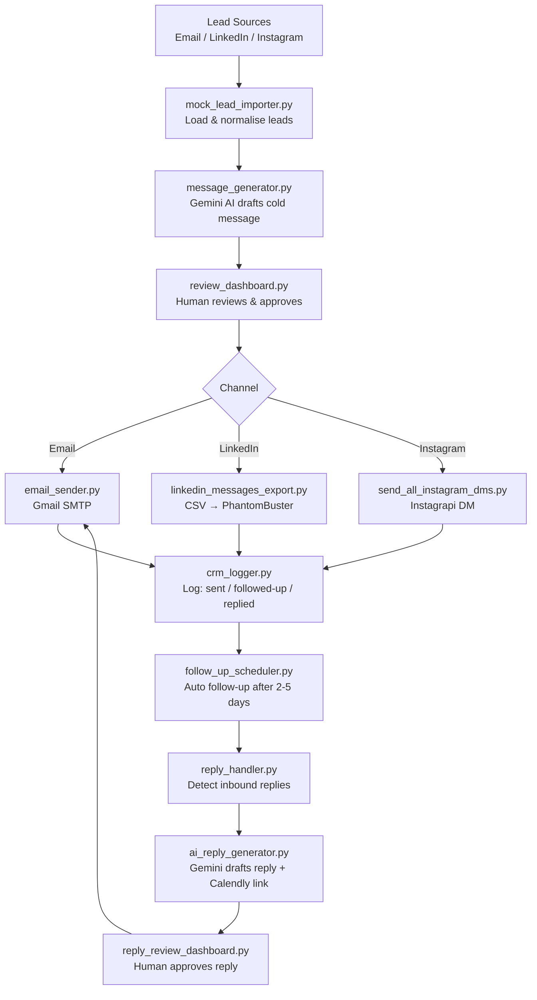

# leadgen_automation

> End-to-end AI-assisted lead generation & outreach — Email · LinkedIn · Instagram · Human-in-the-loop · CRM sync

[DEMO LINK PENDING] · Python · Streamlit · Gemini AI · Instagrapi · PhantomBuster

---

## What it does

Automates the full B2B outreach lifecycle: import leads, draft personalised cold messages with Gemini AI, route them through a human-approval Streamlit dashboard, send across Email/LinkedIn/Instagram, detect inbound replies, draft AI responses, and log everything to a JSON CRM. No message goes out without a human clicking "approve."

## Why it's interesting

Most outreach tools skip human review — this one enforces it by design. The approval-gate architecture means AI generates at scale but a human controls tone and timing. The reply-handling loop (detect inbound → AI draft → human approve → send with Calendly link) closes the full sales cycle in a single codebase.

---

## Architecture



---

## Tech Stack


---

## Demo Screenshots

**Main Control Dashboard**


**AI Reply Review Interface**


**Reply Email Sample**


---

## Setup

```bash
git clone https://github.com/Munazil1/leadgen_automation.git
cd leadgen_automation
pip install -r requirements.txt
```

Create a `.env` file in the project root:

```env
EMAIL_ADDRESS=your_gmail@gmail.com
EMAIL_PASSWORD=your_gmail_app_password
GOOGLE_API_KEY=your_gemini_api_key
IG_USERNAME=your_instagram_username
IG_PASSWORD=your_instagram_password
PHANTOMBUSTER_API_KEY=your_phantombuster_key
PHANTOMBUSTER_PHANTOM_ID=your_phantom_id
```

Launch the main dashboard:

```bash
streamlit run dashboard.py
```

---

## Results / Metrics

| Metric | Value |
|---|---|
| Channels supported | Email, LinkedIn, Instagram |
| Approval gates | 2 (cold outreach + reply) |
| Follow-up scheduling | 2–5 day auto-trigger |
| CRM events logged | Sent, followed-up, replied, meeting booked |
| AI model | Google Gemini Pro |

---

## Future Work

- Replace JSON CRM with a proper database (PostgreSQL + SQLAlchemy)
- Add a leads scoring model to prioritise high-intent contacts
- Build a unified inbox view so all channel replies appear in one dashboard

---

## Note on geckodriver.log

`geckodriver.log` was committed accidentally. To remove it from git history:

```bash
git filter-branch --force --index-filter   "git rm --cached --ignore-unmatch geckodriver.log"   --prune-empty --tag-name-filter cat -- --all
git push origin --force --all
```

It is now listed in `.gitignore` to prevent re-commit.

---

## License

MIT © Munazil V — [munazilv1@gmail.com](mailto:munazilv1@gmail.com) · [LinkedIn](https://linkedin.com/in/munazil-v-a9643a316)
