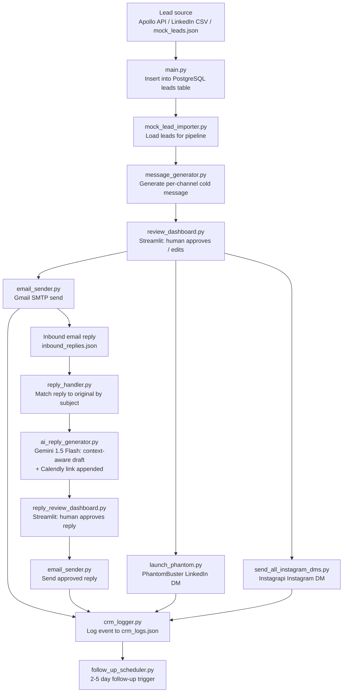
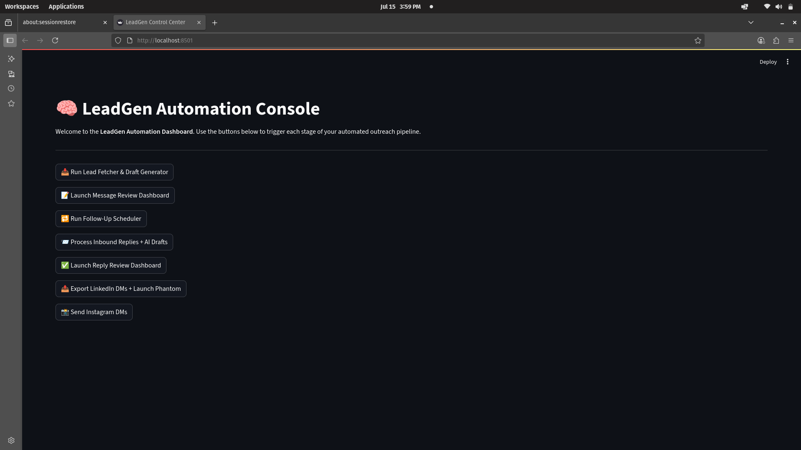
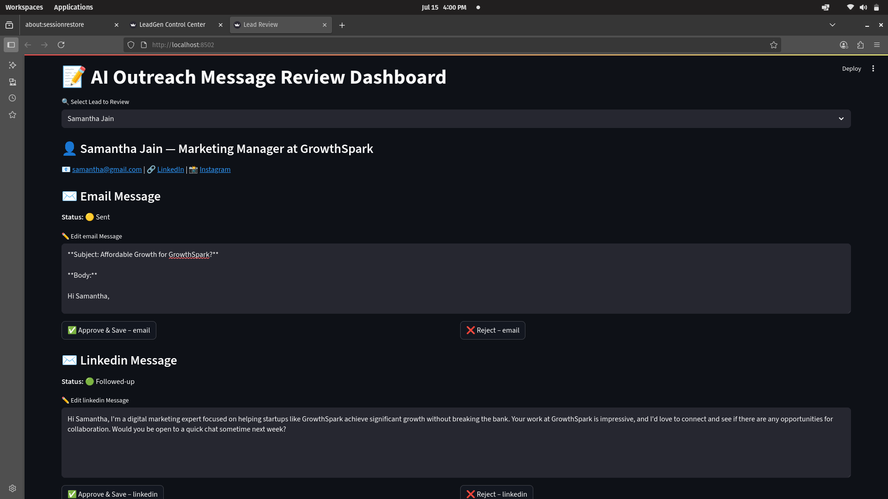
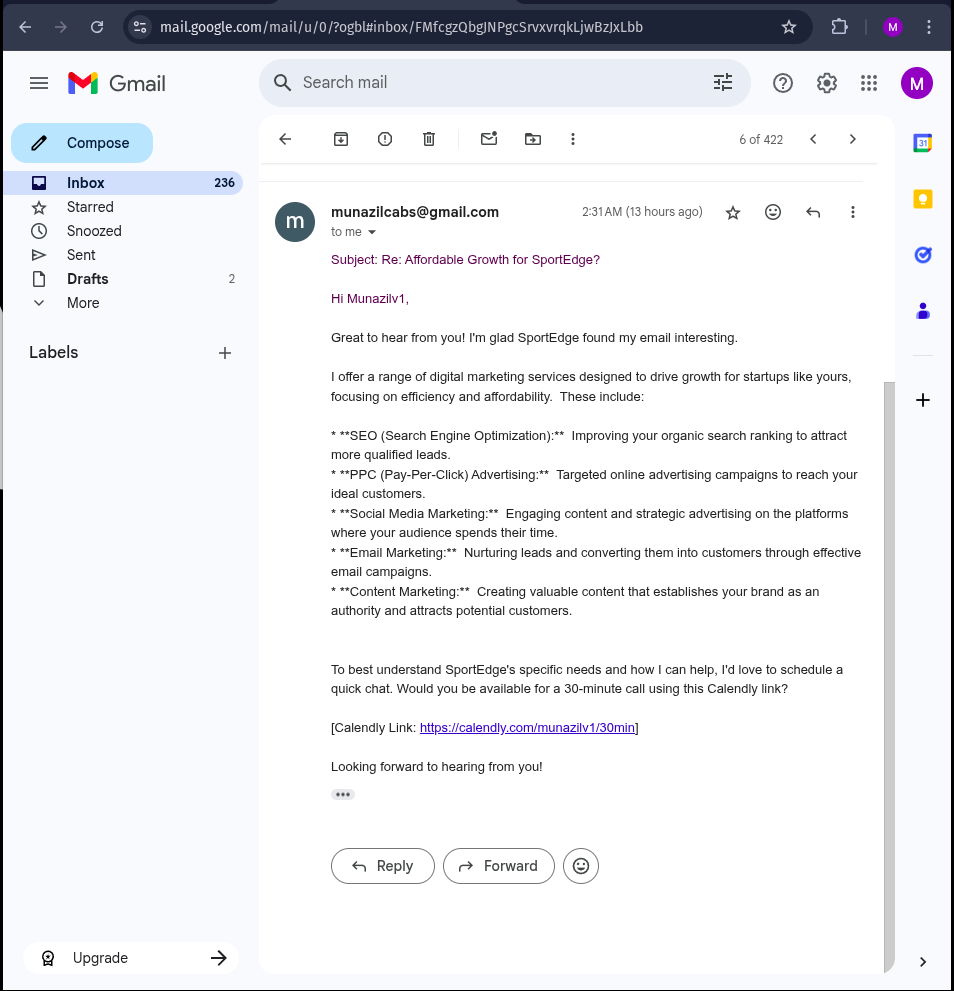

# leadgen_automation — AI-assisted B2B outreach with human-in-the-loop review

Runs the full outreach cycle — lead import, personalised message drafting, multi-channel send, inbound reply handling, and CRM logging — without letting a single message leave without a human clicking approve. Covers Email (SMTP), LinkedIn (PhantomBuster), and Instagram (Instagrapi) from one Streamlit control panel.

---

## What it does

- Imports leads from Apollo/LinkedIn CSV exports or a local mock dataset and stores them in PostgreSQL via `main.py`
- Generates per-channel cold messages (Email, LinkedIn, Instagram) from a per-lead template in `message_generator.py`, then queues them for human review in `review_dashboard.py`
- Sends approved cold messages via Gmail SMTP (`email_sender.py`), LinkedIn via PhantomBuster (`launch_phantom.py`), and Instagram DMs via Instagrapi (`send_all_instagram_dms.py`)
- Detects inbound email replies (`reply_handler.py`), matches them to the original outbound message by subject line, then passes both to Gemini 1.5 Flash (`ai_reply_generator.py`) to draft a context-aware reply with a Calendly booking link appended
- Routes every AI-drafted reply through a second Streamlit review gate (`reply_review_dashboard.py`) before sending
- Logs every outreach event — sent, followed-up, replied, meeting booked — to `crm_logs.json` via `crm_logger.py` with channel, status, and UTC timestamp
- Schedules follow-up messages 2–5 days after the original send via `follow_up_scheduler.py`

## Why it's interesting

- **Two mandatory human gates** — `review_dashboard.py` blocks cold sends; `reply_review_dashboard.py` blocks AI replies. Neither gate can be bypassed from the UI — the Streamlit buttons run the respective review dashboards rather than auto-sending.
- **Context-aware reply drafting** — `ai_reply_generator.py` passes the full original outbound message alongside the inbound reply text in the Gemini prompt, so the draft directly addresses what the lead said rather than generating a generic response.
- **Calendly auto-append** — after Gemini generates the reply, the code checks whether the booking link is present and appends it if missing (`ai_reply_generator.py`, line 56), ensuring every reply surfaces a meeting path.
- **Single control panel orchestrating 7 pipeline stages** — `dashboard.py` uses `subprocess.run()` to invoke each stage module independently, making individual stages replaceable without touching the orchestration layer.
- **Stateful CRM as a JSONL append log** — `crm_logger.py` appends structured events rather than updating rows, giving a complete immutable audit trail of every lead interaction.

## Architecture



`dashboard.py` is the Streamlit control panel — each button calls `subprocess.run()` on the relevant stage module. The two Streamlit review dashboards (`review_dashboard.py`, `reply_review_dashboard.py`) are separate processes launched from the panel.

## Tech Stack


## Screenshots

**Main Control Dashboard** — the 7-stage pipeline orchestrator



**AI Reply Review Interface** — Gemini draft + human approve/edit before send



**Reply Email Sample** — outgoing reply with Calendly link appended



## Setup

```bash
git clone https://github.com/Munazil1/leadgen_automation.git
cd leadgen_automation
pip install streamlit google-generativeai instagrapi requests psycopg2-binary python-dotenv
```

> Note: `requirements.txt` only lists core DB deps. The full install command above includes all runtime dependencies.

Create a `.env` file in the project root:

```env
EMAIL_ADDRESS=munazilv1@gmail.com
EMAIL_PASSWORD=your_gmail_app_password
GOOGLE_API_KEY=your_gemini_api_key
IG_USERNAME=your_instagram_username
IG_PASSWORD=your_instagram_password
PHANTOMBUSTER_API_KEY=your_phantombuster_key
PHANTOMBUSTER_PHANTOM_ID=your_phantom_id
```

Set up PostgreSQL and run the lead importer:

```bash
python main.py
```

Launch the control panel:

```bash
streamlit run dashboard.py
```

Use the dashboard buttons in order: fetch leads → review cold messages → send → process replies → review AI replies → send replies.

## Future Work

- Replace the static cold-message templates in `message_generator.py` with Gemini-generated personalisation — use the lead's role, company, and LinkedIn headline as prompt context
- Migrate `crm_logs.json` to PostgreSQL with a proper schema so pipeline metrics can be queried across campaigns
- Build a unified inbox view in Streamlit so Email, LinkedIn, and Instagram replies all surface in one place without switching tabs

## License

MIT — see [LICENSE](LICENSE).

---

Contact: [munazilv1@gmail.com](mailto:munazilv1@gmail.com) · [LinkedIn](https://www.linkedin.com/in/munazil-v-a9643a316/) · [Portfolio](https://github.com/Munazil1)
